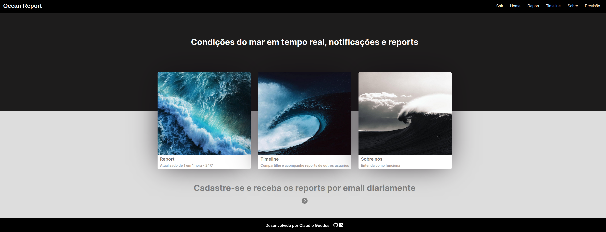
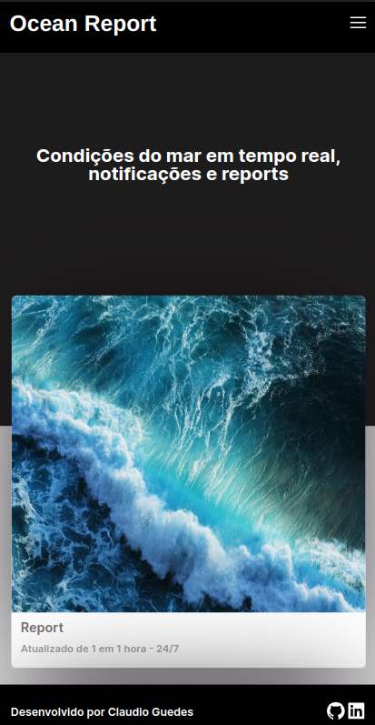
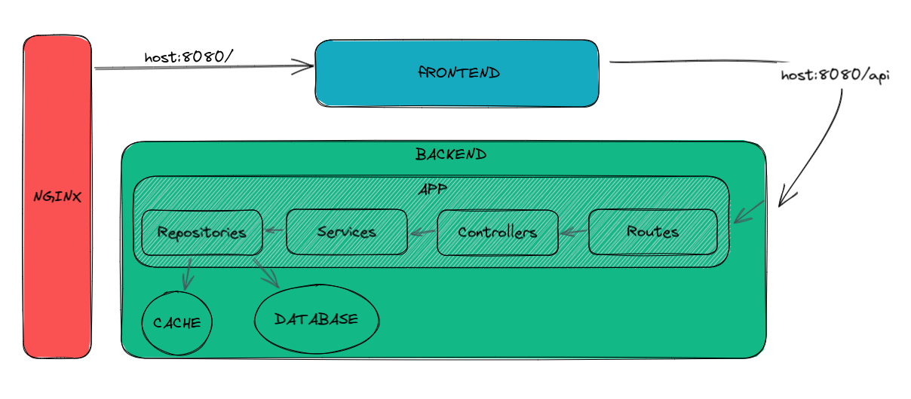

<div align="center">
  <h1>OCEAN REPORT v1.0</h1>
  <br> 
  Ocean Report é um software feito para gerenciar reports das condições oceânicas das praias do Rio de Janeiro. Os reports são feitos através de um algoritmo alimentado com base nos dados em tempo real de uma boia meteo-oceanográfica. Além disso, também é possível receber os reports diretamente por email, e compartilhar suas próprias observações sobre as condições oceânicas na sua região com outros usuários através da nossa timeline.
  <br>
  <br>
  
  <br>
  <br>
  
</div>
<br>

# Arquitetura
<div align="center">
  
  <br>
</div>
<br>
  
# Funcionalidades
- Fluxo de login e cadastro
- Login OAuth com google e github
- Opção de receber reports por email
- Acompanhar reports de outros usuários
- Compartilhar e excluir o seu próprio report
- Acesso a previsão de tempo e mar com link externo (Windy)

# Pŕoximas atualizações para v2.0
- Filtro de palavras ofensivas ao postar uma publicação
- Opção de poder avaliar a acertividade do algoritmo que gera o report
- Opção do usuário poder gerenciar sua conta

# Stack principal Frontend
- React
- TypeScript
- Syled-components
- Docker
- Nginx
- Git
- Linux

# Stack principal Backend
- Node.js
- TypeScript
- Express
- Joi
- Redis
- JWT
- PostgreSQL
- Prisma
- Jest
- Supertest
- Docker
- Nginx
- Git
- Linux


# Como iniciar
1. Clone esse repositório
2. Configure o .env de acordo com o .env.example no backend e frontend
3. Rode o comando docker-compose:
```bash
docker-compose up -d
```
4. Acesse localhost:8080
<br>